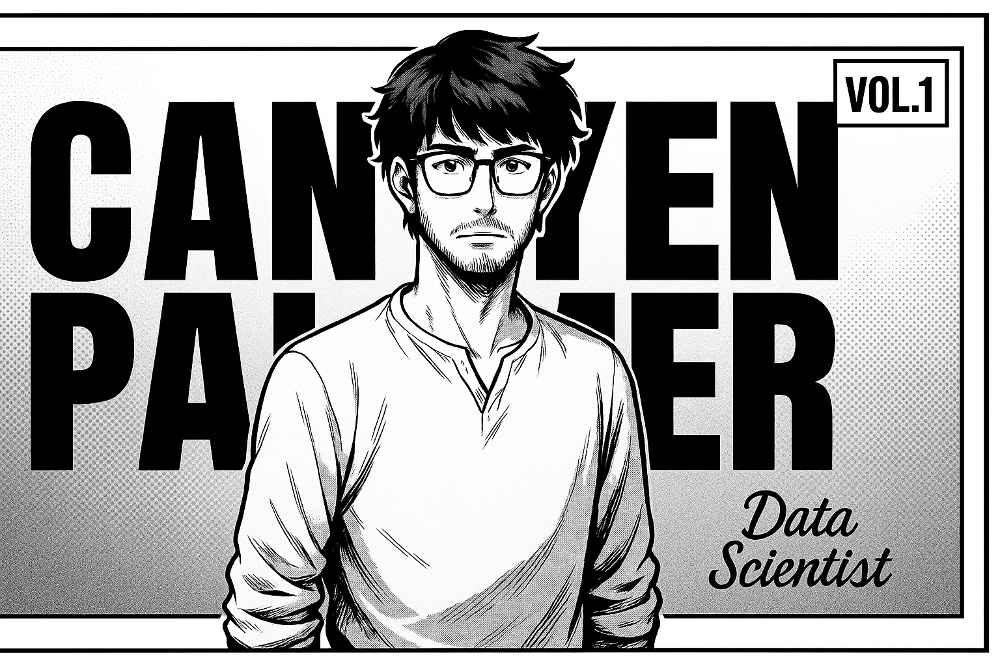

<!-- HEADER SPLASH PANEL -->

  

---

## 📖 PAGE 1 — ORIGIN STORY

<table>
<tr>
<td style="border: 2px solid black; padding: 10px; vertical-align: top;">

**ABOUT ME**  
"Open To Work — let’s connect and start building!"  

I craft models & dashboards that drive decisions end-to-end:  
data wrangling → modeling → visualization → delivery.  

</td>
<td style="border: 2px solid black; padding: 10px; vertical-align: top;">

**CURRENT ARC**  
Healthcare analytics & patient outcomes  

**SIDE QUEST**  
Sports analytics  

</td>
</tr>
</table>

---

## ⚔️ PAGE 2 — THE ARSENAL

<table>
<tr>
<td style="border: 2px solid black; padding: 10px;">

**THE TOOLS OF WAR**  

- **Languages:** Python · R · SQL  
- **Libraries:** pandas · numpy · scikit-learn  
- **Visuals:** Tableau · Power BI · Matplotlib  
- **Other:** Excel/VBA · Google Sheets · GitHub  

</td>
</tr>
</table>

---

## 🧪 PAGE 3 — BATTLE RECORDS

<table>
<tr>
<td style="border: 2px solid black; padding: 10px;">

**CGM Patient Analytics**  
ETL + feature engineering pipeline → glucose risk flags  

</td>
<td style="border: 2px solid black; padding: 10px;">

**MyCaddy (Golf Analytics App)**  
Shot tracking with strokes-gained insights  

</td>
</tr>
<tr>
<td colspan="2" style="border: 2px solid black; padding: 10px;">

**Logistic Regression & Tree-Based ML**  
Modeling workflow & evaluation notebooks  

</td>
</tr>
</table>

> 💡 *Pin these repos below this README for quick access.*

---

## 📊 PAGE 4 — FAVORITE TECHNIQUES

<table>
<tr>
<td style="border: 2px solid black; padding: 10px;">

**FORECASTING! INTERPRETABILITY! REPRODUCIBILITY!**  

- Time-series forecasting  
- Risk & churn classification  
- Model interpretability  
- Tidy, reproducible analytics  

</td>
</tr>
</table>

---

## 🌟 PAGE 5 — HIGHLIGHTS

<table>
<tr>
<td style="border: 2px solid black; padding: 10px;">

✔ Productionized Python data workflows  
✔ Built dashboards stakeholders actually use  
✔ Comfortable explaining models to non-technical audiences  

</td>
</tr>
</table>

---

## 🤝 FINAL PAGE — CALL TO ACTION

<table>
<tr>
<td style="border: 2px solid black; padding: 10px; vertical-align: top;">

**CALL TO ACTION**  
"Open to collaborations — especially technology & sports analytics."  
Let’s talk.  

</td>
<td style="border: 2px solid black; padding: 10px; vertical-align: top;">

**QUICK LINKS**  
- [LinkedIn](https://www.linkedin.com/in/canyen-palmer-b0b6762a0)  
- [Email](mailto:canyen2019@gmail.com)  
- [Portfolio](https://java-portfolio-silk.vercel.app)  

</td>
</tr>
</table>

  

